# EDITH-AI 

Welcome to the internal documentation for **EDITH-AI** (Even Dead, I'm The Hero). This README is designed to explain the complete dynamics, execution flow, and architectural deep-dive of the entire system. It will give you a fundamental understanding of how every component interacts, letting you reconstruct the logic mentally as if you hard-coded it yourself.

---

## Architecture Overview

EDITH is a local, hyper-intelligent cognitive system modeled after J.A.R.V.I.S and Friday. It's not a simple chatbot; it is an **autonomous reasoning agent** with persistent memory, real-time screen vision, semantic context understanding, voice/audio control, and deep integrations with desktop OS capabilities (WhatsApp, browsers, file organization, media playback).

The system follows a central Hub-and-Spoke model where `EdithAssistant` serves as the central brain, dynamically delegating intent through multiple deterministic and non-deterministic routing layers.

### Key Python Modules

- **`main.py` / `launch_adaptive.py`**: The entry points. They configure GPU/CPU isolation to ensure the Local LLM (Ollama) has maximum VRAM while TTS/STT run safely on the CPU.
- **`edith_app/app.py`**: Bootstraps the application, initialising the hidden Tkinter root and firing up the UI.
- **`edith_app/assistant.py`**: The god-class `EdithAssistant`. Wires every single service together.
- **`edith_app/core/neural_router.py`**: The LLM ReAct (Reason + Act) loop. 
- **`edith_app/core/tool_dispatcher.py`**: The execution bridge. Converts JSON LLM commands into local Python method calls across all services.
- **`edith_app/rag/`**: Retrieval-Augmented Generation services, handling vectorized long-term memory.
- **`edith_app/services/`**: The peripheral nervous system (Voice, Audio, WhatsApp, Browser, System, Media, Vision, Desktop Automation).

---

## Complete Execution Flow: From Input to Action

When the user gives a command (either via text UI or voice transcription in `VoiceService`), it lands in `EdithAssistant.handle(command)`. Here is the exact lifecycle of that command:

```mermaid
flowchart TD

    %% =========================================================
    %% STYLES
    %% =========================================================
    classDef file fill:#0f172a,stroke:#3b82f6,color:#f8fafc,stroke-width:2px;
    classDef method fill:#064e3b,stroke:#10b981,color:#ecfdf5,stroke-width:2px;
    classDef decision fill:#581c87,stroke:#a855f7,color:#faf5ff,stroke-width:2px;
    classDef output fill:#7c2d12,stroke:#fb923c,color:#fff7ed,stroke-width:2px;

    %% =========================================================
    %% ENTRY LAYER
    %% =========================================================
    subgraph ENTRY["1️⃣ ENTRY LAYER — User Input"]

        UI_FILE["📄 edith_app/ui.py"]:::file
        UI_METHOD["ui.py<br/>Desktop UI + Stream Callback"]:::method

        VOICE_FILE["📄 edith_app/services/voice_service.py"]:::file
        VOICE_METHOD["VoiceService.listen_for_command()"]:::method

        ASSIST_FILE["📄 edith_app/assistant.py"]:::file
        HANDLE["EdithAssistant.handle(command)"]:::method
        INTERNAL["EdithAssistant._handle_internal(command)"]:::method

        UI_FILE --> UI_METHOD
        VOICE_FILE --> VOICE_METHOD
        ASSIST_FILE --> HANDLE

        UI_METHOD --> HANDLE
        VOICE_METHOD --> HANDLE
        HANDLE --> INTERNAL

    end

    %% =========================================================
    %% LAYER 0
    %% =========================================================
    subgraph L0["2️⃣ LAYER 0 — Deterministic Pattern Routing"]

        ROUTER_FILE["📄 edith_app/core/router_utils.py"]:::file
        ROUTER_METHOD["PatternRouter.route(lowered_cmd)"]:::method

        DISPATCH0_FILE["📄 edith_app/core/tool_dispatcher.py"]:::file
        DISPATCH0["ToolDispatcher.dispatch(action, params)"]:::method

        ROUTER_FILE --> ROUTER_METHOD
        DISPATCH0_FILE --> DISPATCH0

    end

    INTERNAL -->|Pass command| ROUTER_METHOD

    ROUTER_METHOD -->|Regex Match Found| DISPATCH0

    DIRECT["Direct Tool/Service Output"]:::output
    DISPATCH0 --> DIRECT

    %% =========================================================
    %% LAYER 1
    %% =========================================================
    subgraph L1["3️⃣ LAYER 1 — Pending State & Confirmation System"]

        CHECK{"Pending Context Exists?"}:::decision

        %% WhatsApp
        WA_FILE["📄 edith_app/services/whatsapp_service.py"]:::file
        WA_DRAFT["WhatsAppService.send_message()"]:::method
        WA_CALL["WhatsAppService.voice_call()<br/>video_call()"]:::method

        %% Browser
        BROWSER_FILE["📄 edith_app/services/browser_control_service.py"]:::file
        BROWSER_METHOD["confirm_place_order()"]:::method

        %% System
        SYSTEM_FILE["📄 edith_app/services/system_service.py"]:::file
        SYS_METHOD["organize_folder()"]:::method

        %% Assistant Internal
        ASSIST_FILE2["📄 edith_app/assistant.py"]:::file
        SUGGEST["Recurse _handle_internal()"]:::method
        MSG["_finalize_pending_message()"]:::method

        %% RAG Memory
        RAG_FILE["📄 edith_app/services/rag_service.py"]:::file
        FACT["RagService.store_user_fact()"]:::method

        WA_FILE --> WA_DRAFT
        WA_FILE --> WA_CALL

        BROWSER_FILE --> BROWSER_METHOD
        SYSTEM_FILE --> SYS_METHOD

        ASSIST_FILE2 --> SUGGEST
        ASSIST_FILE2 --> MSG

        RAG_FILE --> FACT

    end

    ROUTER_METHOD -->|No Match| CHECK

    CHECK -->|Pending Draft| WA_DRAFT
    CHECK -->|Pending Call| WA_CALL
    CHECK -->|Pending Purchase| BROWSER_METHOD
    CHECK -->|Pending Organization| SYS_METHOD
    CHECK -->|Pending Suggestion| SUGGEST
    CHECK -->|Pending Message| MSG
    CHECK -->|Remember Command| FACT

    WA_DRAFT --> DIRECT
    WA_CALL --> DIRECT
    BROWSER_METHOD --> DIRECT
    SYS_METHOD --> DIRECT
    SUGGEST --> DIRECT
    MSG --> DIRECT
    FACT --> DIRECT

    %% =========================================================
    %% LAYER 2
    %% =========================================================
    subgraph L2["4️⃣ LAYER 2 — AI REASONING + ReAct LOOP"]

        SAFE["EdithAssistant._safe_agent_reply()"]:::method

        %% -----------------------------------------
        %% PREPROCESSING
        %% -----------------------------------------
        subgraph PRE["🧠 Preprocessing + Context Building"]

            VISION_CHECK{"Vision-related Request?"}:::decision

            VISION_FILE["📄 edith_app/services/vision_service.py"]:::file
            VISION_METHOD["VisionService.describe_image()"]:::method

            RAG_FILE2["📄 edith_app/services/rag_service.py"]:::file
            RAG_METHOD["RagService.get_user_memory()"]:::method

            CONTEXT["Build Dynamic Context<br/>• Persona<br/>• Memory<br/>• History<br/>• Task Queue"]:::method

            VISION_FILE --> VISION_METHOD
            RAG_FILE2 --> RAG_METHOD

        end

        %% -----------------------------------------
        %% REACT LOOP
        %% -----------------------------------------
        subgraph REACT["🔁 ReAct Reasoning Loop"]

            NEURAL_FILE["📄 edith_app/core/neural_router.py"]:::file
            NEURAL["NeuralRouter.process()"]:::method

            AGENT_FILE["📄 edith_app/services/agent_service.py"]:::file
            THINK["AgentService.quick_think()<br/>(Ollama Inference)"]:::method

            TOOL_FILE["📄 edith_app/core/tool_dispatcher.py"]:::file
            TOOL["ToolDispatcher.dispatch(action, data)"]:::method

            ACTION{"Next JSON Action?"}:::decision

            SANITIZE["EdithAssistant._sanitize_model_output()"]:::method

            NEURAL_FILE --> NEURAL
            AGENT_FILE --> THINK
            TOOL_FILE --> TOOL

        end

    end

    CHECK -->|No Pending Context| SAFE

    SAFE --> VISION_CHECK

    VISION_CHECK -->|Yes| VISION_METHOD
    VISION_CHECK -->|No| RAG_METHOD

    VISION_METHOD --> RAG_METHOD
    RAG_METHOD --> CONTEXT

    CONTEXT --> NEURAL
    NEURAL --> THINK
    THINK --> ACTION

    ACTION -->|Tool Action| TOOL
    TOOL -->|Tool Result| NEURAL

    ACTION -->|Reply / Max Loops| SANITIZE

    %% =========================================================
    %% OUTPUT LAYER
    %% =========================================================
    subgraph OUTPUT["5️⃣ OUTPUT + FEEDBACK SYSTEM"]

        STREAM_FILE["📄 edith_app/ui.py"]:::file
        STREAM["UI Token Streaming"]:::method

        AUDIO_FILE["📄 edith_app/services/audio_service.py"]:::file
        AUDIO["AudioService.speak_queued()"]:::method

        STREAM_FILE --> STREAM
        AUDIO_FILE --> AUDIO

    end

    SANITIZE -->|Stream Tokens| STREAM
    SANITIZE -->|Sentence Audio| AUDIO

    DIRECT -->|Immediate Output| STREAM
```

### 1. `EdithAssistant._handle_internal`
The command is sanitized and passed into a highly optimized Multi-Layer Routing System:

**Layer 0: Pattern Router (`core.router_utils.PatternRouter`)**
- *Objective:* ~0ms execution for deterministic commands.
- *Mechanism:* Simple regex matching for common local actions (e.g., "volume up", "play spotify"). Bypasses the LLM entirely to save compute. 
- *Outcome:* If matched, the command goes directly to `ToolDispatcher`.

**Layer 1: State Machine (Pending Contexts)**
- *Objective:* Handle conversational continuations without hallucination.
- *Mechanism:* Checks internal memory variables (`_pending_whatsapp_draft`, `_pending_browser_purchase`, `_pending_organization`). If the user says "yes" or "cancel", EDITH maps it to the pending context and executes the final API call instantly.
- *Outcome:* Finalises a flow like WhatsApp confirmation or folder organisation.

**Layer 2: Neural Intelligence (`core.neural_router.NeuralRouter`)**
- *Objective:* For any complex, compound, or ambiguous request.
- *Mechanism:* 
  1. The assistant queries the `VisionService` if words like "screen" or "look at" are used, extracting a visual description of the user's monitor via `PIL.ImageGrab`.
  2. The assistant queries the RAG database for relevant long-term memory facts (`_rag_cache`).
  3. The prompt, vision context, RAG context, and recent conversation history are passed into `NeuralRouter.process()`.

### 2. The ReAct Loop (`NeuralRouter.process`)
This is the core cognitive engine.

1. **Context Construction:** The system merges the System Persona, Tool Manifest, Task Queue state, and short-term conversation transcript.
2. **Execution Loop (Max 6 Steps):**
   - The LLM receives the context and determines the next atomic action in JSON (e.g., `{"action": "search_web", "query": "latest AI news"}`).
   - The action string is sent to `ToolDispatcher`.
   - `ToolDispatcher` maps "search_web" to `SystemService.search_web`, executing it and returning the result.
   - The result is appended to the transcript, and the LLM is queried *again*.
   - The loop continues. If the user asked "List my tasks and play a video for the first one", the LLM will first call `list_tasks`, read the result, call `play_youtube` with the task name, and then call `reply`.
3. **Anti-Looping:** If the LLM repeats the same tool 3 times, a failsafe breaks the loop and forces a summary reply.
4. **Final Reply:** The loop terminates when the LLM outputs the `"reply"` tool action. 

### 3. Output Generation
As the LLM generates the final textual reply, tokens are streamed simultaneously to two locations:
1. **The UI Callback:** Sent token-by-token to update the Tkinter interface in real-time.
2. **The Audio Buffer:** Words are aggregated into sentences. Once a punctuation mark (`.`, `?`, `!`) is hit, the `AudioService` (Kokoro TTS) immediately synthesizes and plays the audio asynchronously.

---

## Service Interactions & Class Dynamics

How do files move and interact? Let's take a complex flow: **"Look at my screen and send a WhatsApp to John about it."**

1. **`assistant.py` (Entry):** Identifies "look at" and "screen". Calls `vision.describe_image()`.
2. **`services/vision_service.py`:** Takes a screenshot, passes it to the local vision model, and returns a text summary (e.g., "The user is looking at Python code for a web server").
3. **`core/neural_router.py`:** Feeds the visual context + user prompt to the LLM agent. 
4. **`services/agent_service.py`:** Contacts the local Ollama instance (e.g., Llama 3) with the ReAct prompt. 
5. **The Agent Output:** The LLM decides it needs to draft a message. It outputs `{"action": "whatsapp_draft", "contact": "John", "message": "Hey John, I'm working on a Python web server right now."}`
6. **`core/tool_dispatcher.py`:** Matches `whatsapp_draft` to the `WhatsAppService`.
7. **`assistant.py` (Callback):** A pending callback updates `_pending_whatsapp_draft`. The LLM outputs `{"action": "reply", "input": "I've drafted a message to John. Should I send it?"}`
8. **Next Interaction:** User says "Yes". 
9. **`assistant.py` (Layer 1):** Bypasses the LLM, reads `_pending_whatsapp_draft`, and fires `whatsapp.send_message()`.
10. **`services/whatsapp_service.py`:** Automates the WhatsApp Desktop client or Web instance to dispatch the text.

---

## The Nervous System: Specialized Services

- **`TaskEngine` & `Cowork Loop`:** Manages a stateful task queue. The `AgentLoop` can autonomously work through tasks, searching the web and modifying files in the background.
- **`RagService` (`rag/` folder):** Handles explicit memory ("Remember that my dog's name is Max"). It embeds facts and retrieves them dynamically based on the semantic similarity of the current command.
- **`AppControlService` & `BrowserControlService`:** Perform system-level manipulation. For browsers, it can read DOM structures and even navigate purchase flows with explicit Layer 1 user confirmations.

## Summary

By understanding `assistant.py` as the traffic controller, `NeuralRouter` as the brain, `ToolDispatcher` as the spinal cord, and the `services/` directory as the limbs, you have mastered the complete architectural dynamic of EDITH-AI. All complex reasoning runs in multi-step loops within `neural_router.py`, while hardware/OS integrations are deeply isolated in their respective service classes.

---

## File & Function Reference Directory

Use the directory below to track and navigate the codebase. It shows exactly which `.py` file contains which classes, functions, and key definitions.

| Subsystem / Layer | Python File Path | Class Name | Function / Definition | Purpose & System Role |
| :--- | :--- | :--- | :--- | :--- |
| **0. Entry Points** | `main.py` | *None (Script)* | `main()` | Sets GPU/CPU boundaries (CUDA_VISIBLE_DEVICES isolation) and suppressor logs. |
| | `edith_app/app.py` | *None (Script)* | `main()` | Bootstraps central Tkinter context, boots configs, logs, and initializes `EdithDesktopUI`. |
| | `edith_app/ui.py` | `EdithDesktopUI` | `run()`, `_on_token()` | Directs desktop window loop, streams model replies token-by-token. |
| | `edith_app/services/voice_service.py` | `VoiceService` | `listen_for_command()`, `listen_once()`, `start_session()`, `stop_session()` | Activates Vosk/local recognizer and manages micro-capture interruptions. |
| **1. Brain Core** | `edith_app/assistant.py` | `EdithAssistant` | `handle(command)`, `_handle_internal(command)`, `_safe_agent_reply(command)`, `_sanitize_model_output()`, `_finalize_pending_message()` | Central orchestration layer routing commands through Layer 0, Layer 1, and Layer 2. Handles token/speech piping. |
| **2. Layer 0 (Pattern)** | `edith_app/core/router_utils.py` | `PatternRouter` | `route(command)` | Fast matching via regex patterns for deterministic system commands (~0ms). |
| | `edith_app/core/tool_dispatcher.py` | `ToolDispatcher` | `dispatch(action, params)` | Direct utility executor to invoke hardware or system scripts immediately. |
| **3. Layer 1 (Confirmations)**| `edith_app/services/whatsapp_service.py` | `WhatsAppService` | `send_message()`, `voice_call()`, `video_call()`, `read_current_chat()` | Controls WhatsApp Desktop UI/API automation layers. |
| | `edith_app/services/browser_control_service.py`| `BrowserControlService`| `confirm_place_order()`, `summarize_purchase_plan()` | Coordinates headless/headed checkouts and processes orders safely. |
| | `edith_app/services/system_service.py` | `SystemService` | `organize_folder()`, `wifi()`, `bluetooth()`, `set_brightness()` | Performs direct system adjustments and context-based file organization. |
| | `edith_app/services/rag_service.py` | `RagService` | `store_user_fact()`, `get_user_memory()` | Exposes local chroma/vector DB mechanisms for fact retrieval and updates. |
| **4. Preprocessing** | `edith_app/services/vision_service.py` | `VisionService` | `describe_image()` | Takes pillow-based snapshots of active screens and feeds descriptive context to LLM. |
| **5. Layer 2 (AI ReAct)** | `edith_app/core/neural_router.py` | `NeuralRouter` | `process(user_prompt, history, ...)` | Autonomous ReAct loops that request intermediate tool states until a final `reply` is resolved. |
| | `edith_app/services/agent_service.py` | `AgentService` | `quick_think()`, `parse_intent()`, `runtime_status()` | Direct wrapper calls to Ollama Local LLM instances using quick generation schemas. |
| | `edith_app/core/tool_dispatcher.py` | `ToolDispatcher` | `dispatch(action, data)` | Resolves step-by-step intermediate JSON tool commands back to RAG/System/Cowork controllers. |
| **6. Output Aggregators**| `edith_app/services/audio_service.py` | `AudioService` | `speak_queued()`, `speak()`, `clear_queue()` | Accumulates token sentences in queues for asynchronous Kokoro TTS narration. |

